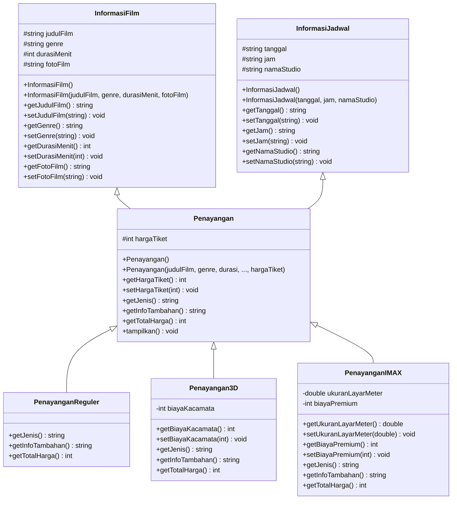
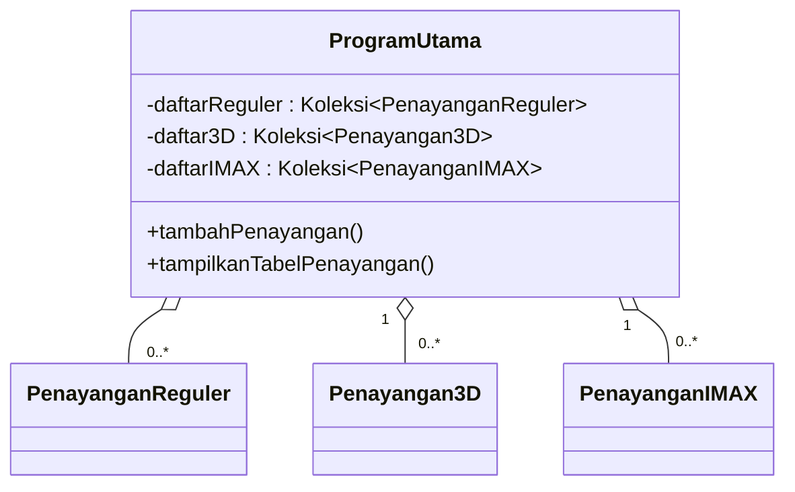
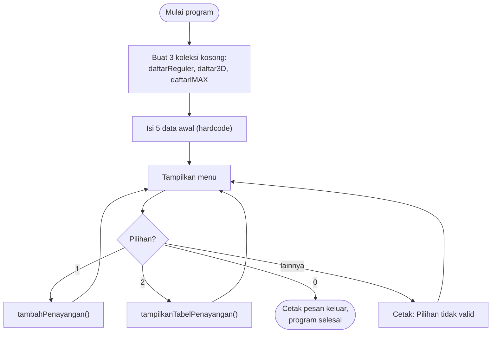
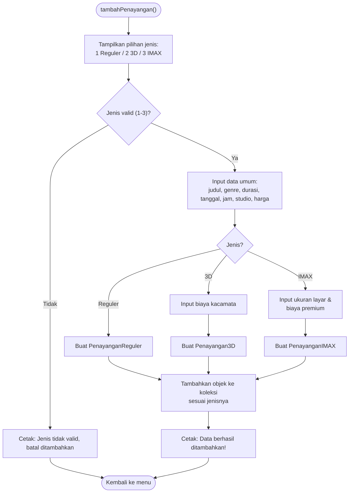
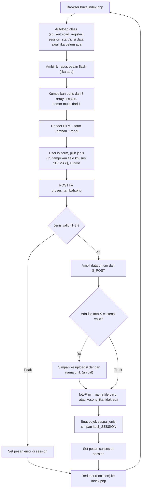

# TP2DPBO2526C2 — Pengelolaan Penayangan Bioskop

```
Saya Mohammad Arya Dhinata dengan NIM 2504992 mengerjakan Tugas Praktikum 2 dalam mata kuliah Desain
Pemrograman Berbasis Objek untuk keberkahan-Nya maka saya tidak melakukan kecurangan seperti
yang di spesifikasikan. Aamiin
```

Tugas Praktikum 2 (DPBO 2025/2026, kelas C2): program **Create & Read** untuk mengelola data **penayangan film di bioskop**, dengan fokus utama pada **pewarisan ganda (multiple inheritance)** — satu objek `Penayangan` menggabungkan data dari **dua sumber sekaligus** (`InformasiFilm` dan `InformasiJadwal`), lalu diturunkan lagi menjadi tiga jenis tayangan konkret: **Reguler**, **3D**, dan **IMAX**. Diimplementasikan dalam **4 bahasa**: C++, Java, Python, dan PHP (versi web, dengan tambahan fitur upload foto poster).

Keempat implementasi berbagi desain yang sama secara konsep, tetapi **cara mewujudkan pewarisan ganda berbeda di tiap bahasa** karena tidak semua bahasa mengizinkan sebuah class mewarisi dua class sekaligus — inilah bagian paling menarik untuk dibandingkan di dokumen ini (lihat bagian [2.6](#26-implementasi-pewarisan-ganda-per-bahasa)).

---

## Daftar Isi

1. [Struktur Folder](#1-struktur-folder)
2. [Desain Program](#2-desain-program)
3. [Alur Kode](#3-alur-kode)
4. [Cara Menjalankan](#4-cara-menjalankan)
5. [Dokumentasi Screenshot](#5-dokumentasi-screenshot)
6. [Catatan dan Batasan](#6-catatan-dan-batasan)

---

## 1. Struktur Folder

```
TP2DPBO2526C2/
├── README.md
├── Cpp/
│   ├── InformasiFilm.cpp        # base class 1: data film (judul, genre, durasi)
│   ├── InformasiJadwal.cpp      # base class 2: data jadwal (tanggal, jam, studio)
│   ├── Penayangan.cpp           # PEWARISAN GANDA dari keduanya + hargaTiket
│   ├── PenayanganReguler.cpp    # turunan Penayangan
│   ├── Penayangan3D.cpp         # turunan Penayangan
│   ├── PenayanganIMAX.cpp       # turunan Penayangan
│   ├── Main.cpp                 # menu + Create/Read (meng-include semua .cpp di atas)
│   ├── Main.exe                 # hasil kompilasi
│   └── testcase.txt             # input contoh untuk uji otomatis
├── Java/
│   ├── InformasiFilm.java
│   ├── InformasiJadwal.java     # dipakai lewat composition (has-a), BUKAN extends
│   ├── Penayangan.java
│   ├── PenayanganReguler.java
│   ├── Penayangan3D.java
│   ├── PenayanganIMAX.java
│   ├── Main.java
│   └── testcase.txt
├── Python/
│   ├── InformasiFilm.py
│   ├── InformasiJadwal.py
│   ├── Penayangan.py            # pewarisan ganda ASLI (Python native)
│   ├── PenayanganReguler.py
│   ├── Penayangan3D.py
│   ├── PenayanganIMAX.py
│   ├── Main.py
│   └── testcase.txt
├── PHP/
│   ├── classes/
│   │   ├── InformasiFilm.php    # + atribut fotoFilm (poster), khusus PHP
│   │   ├── InformasiJadwal.php  # TRAIT, dipakai lewat 'use'
│   │   ├── Penayangan.php
│   │   ├── PenayanganReguler.php
│   │   ├── Penayangan3D.php
│   │   └── PenayanganIMAX.php
│   ├── index.php                # form Tambah + tabel Tampilkan (digabung 1 halaman)
│   ├── proses_tambah.php        # handle submit form + upload foto
│   └── uploads/                 # penyimpanan fisik file poster hasil upload
└── Dokumentasi/
    ├── Cpp/                     # screenshot C++
    ├── Java/                    # screenshot Java
    ├── Python/                  # screenshot Python
    └── PHP/                     # screenshot PHP
```

---

## 2. Desain Program

### 2.1 Konsep OOP yang Digunakan

| Konsep | Penerapan |
|---|---|
| **Pewarisan ganda (multiple inheritance)** | `Penayangan` mengambil atribut & method dari **dua** sumber: `InformasiFilm` (judul, genre, durasi) dan `InformasiJadwal` (tanggal, jam, studio). Caranya berbeda di tiap bahasa — lihat [2.6](#26-implementasi-pewarisan-ganda-per-bahasa). |
| **Pewarisan tunggal berjenjang** | `PenayanganReguler`, `Penayangan3D`, `PenayanganIMAX` masing-masing mewarisi `Penayangan`. |
| **Enkapsulasi** | Atribut `protected`/`private`, diakses lewat *getter/setter*. Python memakai konvensi publik tetapi tetap menyediakan getter/setter agar desainnya seragam dengan 3 bahasa lain. |
| **Constructor chaining** | Constructor tiap class turunan meneruskan data ke constructor induknya: *initializer list* (C++), `super(...)` (Java), `super().__init__()` / pemanggilan eksplisit (Python), `parent::__construct()` (PHP). |
| **Redefinisi method, BUKAN polymorphism** | `getJenis()`, `getInfoTambahan()`, `getTotalHarga()` didefinisikan ulang di tiap class turunan, tapi objek tiap jenis **sengaja** disimpan di koleksi terpisah (`daftarReguler`, `daftar3D`, `daftarIMAX`) — bukan satu koleksi `List<Penayangan>` gabungan — walau Java, Python, dan PHP sebenarnya mendukung *dynamic dispatch* secara otomatis. |
| **Pemisahan tanggung jawab** | Class `Informasi*`/`Penayangan*` murni model data. Menu, input, dan proses Create/Read ada di `Main.*` (CLI) atau `index.php` + `proses_tambah.php` (web). |

### 2.2 Class `InformasiFilm` dan `InformasiJadwal` (base classes)

**Atribut `InformasiFilm`**

| Atribut | Tipe | Keterangan |
|---|---|---|
| `judulFilm` | string | Judul film, contoh `"Zootopia 2"` |
| `genre` | string | Genre film, contoh `"Animasi"` |
| `durasiMenit` | int | Lama film dalam menit |
| `fotoFilm` | string | **Khusus PHP.** Nama file poster di folder `uploads/`, atau `""` jika belum ada |

**Atribut `InformasiJadwal`**

| Atribut | Tipe | Keterangan |
|---|---|---|
| `tanggal` | string | Format `YYYY-MM-DD` |
| `jam` | string | Format `HH:MM` |
| `namaStudio` | string | Contoh `"Studio 1"` |

**Method (kedua class)**: constructor (default + berparameter), `getXxx()`/`setXxx()` untuk tiap atribut. `InformasiFilm` versi PHP menambah `getFotoFilm()`, `setFotoFilm()`, dan `adaFoto()` (true jika `fotoFilm` terisi).

### 2.3 Class `Penayangan` (hasil pewarisan ganda)

| Atribut | Tipe | Keterangan |
|---|---|---|
| `hargaTiket` | int | Harga tiket dasar, belum termasuk biaya tambahan |

| Method | Fungsi |
|---|---|
| Constructor | Meneruskan data ke `InformasiFilm` & `InformasiJadwal`, lalu mengisi `hargaTiket` |
| `getHargaTiket()` / `setHargaTiket()` | Akses atribut `hargaTiket` |
| `getJenis()` | Versi dasar mengembalikan `"Reguler"` (ditimpa tiap turunan) |
| `getInfoTambahan()` | Versi dasar mengembalikan `"-"` (ditimpa tiap turunan) |
| `getTotalHarga()` | Versi dasar mengembalikan `hargaTiket` saja (ditimpa tiap turunan) |
| `tampilkan()` | Mencetak semua atribut ke konsol. **Tidak dipakai** di PHP karena data ditampilkan lewat tabel HTML |

### 2.4 Class Turunan: `PenayanganReguler`, `Penayangan3D`, `PenayanganIMAX`

| Class | Atribut tambahan | `getJenis()` | `getInfoTambahan()` | `getTotalHarga()` |
|---|---|---|---|---|
| `PenayanganReguler` | *(tidak ada)* | `"Reguler"` | `"Tanpa fasilitas tambahan"` | `hargaTiket` |
| `Penayangan3D` | `biayaKacamata` (int) | `"3D"` | `"Kacamata 3D (+RpX)"` | `hargaTiket + biayaKacamata` |
| `PenayanganIMAX` | `ukuranLayarMeter` (double/float), `biayaPremium` (int) | `"IMAX"` | `"Layar Xm (+RpY)"` | `hargaTiket + biayaPremium` |

Ketiganya juga mewarisi `getHargaTiket()`, `getJudulFilm()`, `getGenre()`, `getDurasiMenit()`, `getTanggal()`, `getJam()`, `getNamaStudio()` dari kedua base class di atas tanpa perlu menulis ulang.

### 2.5 Class Diagram



**Diagram koleksi data** (menegaskan poin "redefinisi method, bukan polymorphism" di 2.1):



### 2.6 Implementasi Pewarisan Ganda per Bahasa

Ini bagian paling penting dari tugas ini: **tidak semua bahasa mengizinkan `class X extends A, B`**.

| Bahasa | Cara `InformasiJadwal` "digabung" ke `Penayangan` |
|---|---|
| **C++** | Pewarisan ganda asli (native): `class Penayangan : public InformasiFilm, public InformasiJadwal`. Constructor memanggil kedua induk lewat *initializer list*. |
| **Java** | **Tidak bisa** `extends` dua class. `Penayangan extends InformasiFilm`, sedangkan `InformasiJadwal` disimpan sebagai **objek di dalam field** (composition / *has-a*). Method seperti `getTanggal()` didelegasikan: memanggil `jadwal.getTanggal()` di baliknya. |
| **Python** | Pewarisan ganda asli, sama seperti C++: `class Penayangan(InformasiFilm, InformasiJadwal)`. Karena tanda tangan constructor kedua induk berbeda, keduanya dipanggil **eksplisit satu per satu** (`InformasiFilm.__init__(self, ...)` lalu `InformasiJadwal.__init__(self, ...)`), bukan lewat rantai `super()`. |
| **PHP** | **Tidak bisa** `extends` dua class (sama seperti Java), tapi punya fitur **trait** yang tidak dimiliki Java/C++/Python: `class Penayangan extends InformasiFilm { use InformasiJadwal; }`. Trait `InformasiJadwal` "disalin-tempel" ke dalam `Penayangan`, sehingga efeknya mirip pewarisan ganda tanpa perlu composition manual. |

### 2.7 Pembagian Tanggung Jawab

| Lapisan | Berkas | Tugas |
|---|---|---|
| **Model** | `InformasiFilm.*`, `InformasiJadwal.*`, `Penayangan*.*` | Menyimpan data & menyediakan akses lewat getter/setter |
| **Controller + View (CLI)** | `Main.cpp` / `Main.java` / `Main.py` | Menampilkan menu, membaca input, memanggil Create/Read, mencetak tabel |
| **Controller (Web)** | `proses_tambah.php` | Validasi input, upload foto, membuat object, menyimpan ke session |
| **View (Web)** | `index.php` | Menampilkan form & tabel, membaca session |

#### Fungsi Create & Read di Setiap Bahasa

| Operasi | C++ | Java | Python | PHP |
|---|---|---|---|---|
| **Create** | `tambahPenayangan(vector&, vector&, vector&)` | `tambahPenayangan(List, List, List)` | `tambah_penayangan(daftar_reguler, daftar_3d, daftar_imax)` | Form `index.php` → POST ke `proses_tambah.php` |
| **Read** | `tampilkanTabelPenayangan(vector&, vector&, vector&)` | `tampilkanTabelPenayangan(List, List, List)` | `tampilkan_tabel_penayangan(...)` | `foreach` pada 3 array `$_SESSION`, dirender jadi `<table>` di `index.php` |

### 2.8 Perbandingan Antar Bahasa

| Aspek | C++ | Java | Python | PHP |
|---|---|---|---|---|
| Penyimpanan data | `vector<T>` (3 buah) | `List<T>` (3 buah) | `list` (3 buah) | array di `$_SESSION` (3 buah) |
| Pewarisan `InformasiJadwal` | `extends` asli | composition (field) | `extends` asli | `trait` + `use` |
| Penghubung file | `#include "Xxx.cpp"` | 1 folder, saling terlihat otomatis | `from Xxx import Xxx` | `spl_autoload_register` (autoload) |
| Penamaan | camelCase | camelCase | snake_case | camelCase |
| Kontrol menu | `do-while` + `switch` | `do-while` + `switch` | `while True` + `if/elif` | tidak ada menu; form + tabel di 1 halaman |
| Cara input | `cin` + `getline` + `bersihkanBuffer()` | `Scanner.nextLine()` + `parseInt` (retry jika salah) | `input()` + `try/except` (retry jika salah) | form HTML (`$_POST`, `$_FILES`) |
| **Nomor urut tabel mulai dari** | **0** | **1** | **1** | **1** |
| Redefinisi method | tidak `virtual` (static binding) | otomatis override (dynamic binding) | otomatis override (dynamic binding) | otomatis override (dynamic binding) |

> Baris **"Nomor urut tabel mulai dari"** memang sengaja tidak seragam — lihat [bagian 6](#6-catatan-dan-batasan).

### 2.9 Penyimpanan Data

Tidak ada database. Semua data hidup **di memori** selama program/aplikasi berjalan:

- **C++ / Java / Python:** disimpan di `vector`/`List`/`list` di memori. Data hilang saat program ditutup.
- **PHP:** disimpan di `$_SESSION`, bertahan antar-request selama sesi browser aktif. **File poster** (foto) adalah satu-satunya data yang benar-benar tersimpan permanen di disk, di folder `uploads/` — path/nama filenya dicatat di atribut `fotoFilm`.

---

## 3. Alur Kode

### 3.1 Alur Utama (C++, Java, Python)



Menu yang ditampilkan:

```
===== MENU PENGELOLAAN PENAYANGAN BIOSKOP =====
1. Tambah Penayangan (Create)
2. Tampilkan Semua Penayangan (Tabel)
0. Keluar
Pilihan Anda:
```

### 3.2 Create



### 3.3 Read

1. Jika ketiga koleksi kosong → cetak `(Belum ada data penayangan)`, kembali ke menu.
2. Kumpulkan baris dari `daftarReguler`, lalu `daftar3D`, lalu `daftarIMAX` (dikelompokkan per jenis, bukan urutan input), sambil menomori tiap baris.
3. **CLI (C++/Java/Python):** hitung lebar tiap kolom = teks terpanjang di kolom itu, lalu cetak garis dan baris memakai lebar tersebut.
4. **PHP:** langsung dirender jadi elemen `<table>` HTML — lebar kolom diatur otomatis oleh browser/CSS, tidak perlu perhitungan manual.

### 3.4 Detail Khusus per Bahasa

**C++**
- `Main.cpp` meng-`#include` seluruh `.cpp` lain, jadi cukup mengompilasi `Main.cpp` saja.
- Ketiga koleksi dikirim **by reference** (`vector<T>&`) agar perubahan di dalam fungsi berlaku pada data asli.
- `bersihkanBuffer()` dipanggil setiap selesai `cin >> ...` supaya `getline` berikutnya tidak "terlompat" oleh newline yang tersisa.
- **Tidak ada validasi** jika input angka diisi huruf (`cin >> int` akan gagal secara diam-diam).

**Java**
- `InformasiJadwal` dipakai lewat **composition**, bukan `extends` (lihat 2.6). Getter/setter jadwal di `Penayangan` mendelegasikan ke objek `InformasiJadwal` di dalamnya.
- Semua input dibaca dengan `nextLine()`, dikonversi manual (`Integer.parseInt`/`Double.parseDouble`) di dalam `try/catch` yang **mengulang pertanyaan** jika input bukan angka — tidak pernah crash.

**Python**
- Pewarisan ganda ditulis langsung: `class Penayangan(InformasiFilm, InformasiJadwal)`.
- Constructor kedua induk dipanggil eksplisit (`InformasiFilm.__init__(self, ...)`, `InformasiJadwal.__init__(self, ...)`), bukan lewat `super()`, karena parameter keduanya berbeda.
- Input angka dibungkus `while True` + `try/except ValueError`, mengulang sampai valid.

**PHP** (alur web, berbeda dari CLI — lihat 3.5)
- `InformasiJadwal` adalah **trait**, dipakai lewat `use InformasiJadwal;` di dalam `Penayangan`.
- Tidak ada menu; form "Tambah" dan tabel "Tampilkan" ada di satu halaman (`index.php`).
- Setiap kali data ditambahkan, terjadi **redirect** ke `index.php` (pola *Post/Redirect/Get*) supaya refresh browser tidak mengirim ulang form.

### 3.5 Alur PHP (Web)



Poin penting alur PHP:

- **`enctype="multipart/form-data"`** wajib ada di form, atau `$_FILES` akan selalu kosong walau file sudah dipilih.
- **Flash message.** Pesan sukses/error disimpan sebentar di `$_SESSION['pesan']`, diambil lalu langsung dihapus di `index.php` — sehingga hanya tampil sekali, tidak muncul lagi walau halaman di-refresh.
- **Upload foto.** File disimpan ke `uploads/` dengan nama dibuat unik memakai `uniqid()`, agar dua upload dengan nama asli sama tidak saling menimpa. Ekstensi dibatasi ke `jpg, jpeg, png, gif, webp`.
- **Placeholder foto.** Tabel mengecek `adaFoto()` **dan** `file_exists()` sebelum menampilkan `` — jika file fotonya belum benar-benar ada di `uploads/`, tabel menampilkan teks "Tidak ada foto" alih-alih ikon gambar rusak.
- **Keamanan tampilan.** Semua data yang dicetak ke HTML dibungkus `htmlspecialchars()` untuk mencegah celah XSS.

---

## 4. Cara Menjalankan

**C++**
```bash
cd Cpp
g++ Main.cpp -o Main
./Main              # Windows: Main.exe
./Main < testcase.txt   # opsional: jalankan otomatis dengan input dari testcase.txt
```

**Java**
```bash
cd Java
javac *.java
java Main
java Main < testcase.txt
```

**Python**
```bash
cd Python
python Main.py       # atau: python3 Main.py
python Main.py < testcase.txt
```

**PHP**
```bash
cd PHP
php -S localhost:8000
```
Lalu buka `http://localhost:8000` di browser. Bisa juga ditaruh di folder `htdocs` XAMPP/Laragon dan diakses lewat `http://localhost/PHP/`. Pastikan folder `uploads/` ada dan bisa ditulis (*writable*) oleh server.

---

## 5. Dokumentasi Screenshot

### C++, Java, dan Python

| Skenario | C++ | Java | Python |
|---|---|---|---|
| Menu awal | [lihat](Dokumentasi/Cpp/Menu.png) | [lihat](Dokumentasi/Java/Menu.png) | [lihat](Dokumentasi/Python/Menu.png) |
| Tambah (Create) | [lihat](Dokumentasi/Cpp/Add.png) | [lihat](Dokumentasi/Java/Add.png) | [lihat](Dokumentasi/Python/Add.png) |
| Tampilkan tabel (Read) | [lihat](Dokumentasi/Cpp/Read.png) | [lihat](Dokumentasi/Java/Read.png) | [lihat](Dokumentasi/Python/Read.png) |
| Tabel setelah Create | [lihat](Dokumentasi/Cpp/ReadAfterAdd.png) | [lihat](Dokumentasi/Java/ReadAfterAdd.png) | [lihat](Dokumentasi/Python/ReadAfterAdd.png) |
| Keluar program | [lihat](Dokumentasi/Cpp/MenuOut.png) | [lihat](Dokumentasi/Java/MenuOut.png) | [lihat](Dokumentasi/Python/MenuOut.png) |

### PHP

| Skenario | Screenshot |
|---|---|
| Form kosong | [AddBlank.png](Dokumentasi/PHP/AddBlank.png) |
| Form terisi (sebelum submit) | [Add.png](Dokumentasi/PHP/Add.png) |
| Pesan sukses setelah submit | [AddSucces.png](Dokumentasi/PHP/AddSucces.png) |
| Tabel dengan foto poster | [Read.png](Dokumentasi/PHP/Read.png) |
| Tabel setelah data baru ditambahkan | [ReadAfterAdd.png](Dokumentasi/PHP/ReadAfterAdd.png) |

---

## 6. Catatan dan Batasan

**Cakupan fitur**

- Program ini **hanya mencakup Create dan Read**. Tidak ada Update maupun Delete — berbeda dari tugas praktikum sebelumnya (TP1) yang CRUD penuh.
- Data ditampilkan dikelompokkan per jenis (semua Reguler dulu, lalu 3D, lalu IMAX), **bukan** berdasarkan urutan data ditambahkan.

**Inkonsistensi yang disengaja/tersisa**

| Hal | C++ | Java | Python | PHP |
|---|---|---|---|---|
| Nomor urut tabel mulai dari | **0** | 1 | 1 | 1 |
| Validasi input angka salah ketik | tidak divalidasi (bisa gagal diam-diam) | divalidasi, input diulang | divalidasi, input diulang | divalidasi lewat atribut HTML `required`/`type` |
| Atribut `fotoFilm` (poster) | tidak ada | tidak ada | tidak ada | **ada** (permintaan tambahan khusus PHP) |

**Hal lain yang perlu diketahui**

- **Data tidak persisten.** Data hilang saat program (C++/Java/Python) ditutup atau session PHP berakhir. Pengecualian: **file poster** PHP tetap tersimpan fisik di `uploads/` walau data tabelnya sudah hilang dari session (berpotensi jadi *file yatim*/orphan jika session berakhir sebelum foto "dipakai" lagi).
- **Data awal sama di keempat bahasa**: *Avengers: Doomsday*, *Zootopia 2*, *Spider-Man: Brand New Day*, *Avatar: Fire and Ash*, *Dune: Part Three* — lima data ini dihardcode identik di C++, Java, Python, dan PHP.
- **Upload foto PHP** dibatasi ekstensi (`jpg, jpeg, png, gif, webp`) dan diberi nama unik lewat `uniqid()`, tetapi **tidak ada validasi ukuran file maksimum**.
- **Artefak build** (`Main.exe`) ikut berada di folder `Cpp/`. Sebaiknya ditambahkan ke `.gitignore` jika proyek ini dipush ke Git.
